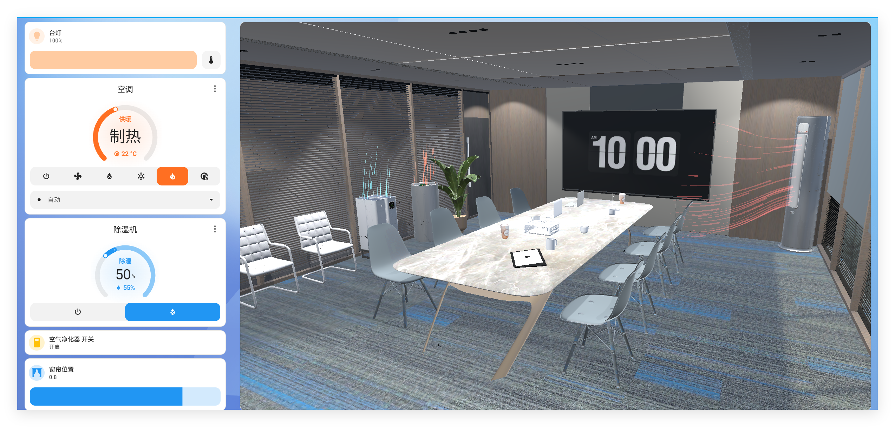
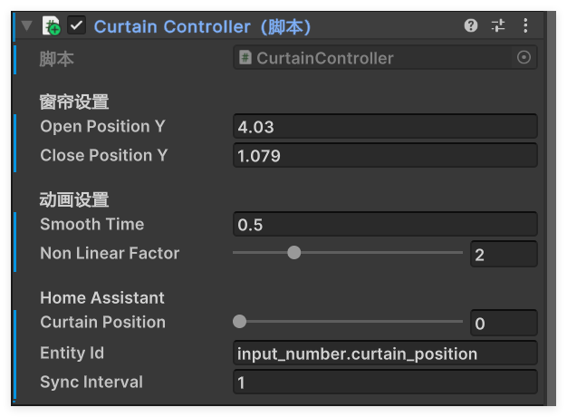
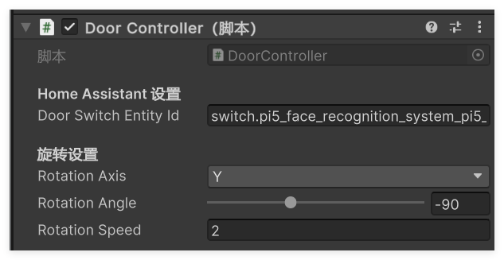
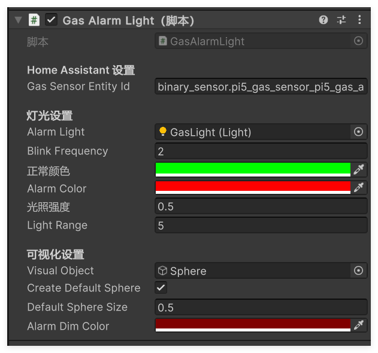

# Unity3D与HomeAssistant通信

## 0. 项目概述
本项目旨在演示如何使用Unity3D与HomeAssistant进行通信，实现智能家居的3D可视化。项目包含了Unity脚本、预制体。

通过导出Unity项目为WebGL，可在浏览器中运行，并可通过iframe嵌入到HA面板中。


**注意：本项目仅作为演示，不保证稳定性和安全性。在实际应用中，请确保遵守相关法律法规和安全标准。**

**测试平台**：Unity3D 2023.1.12f1c1

## 1. 项目结构概述

项目主要在`/Scripts`文件夹内，主要包含以下几个关键脚本：

- `HomeAssistantAPI.cs`: 处理与HomeAssistant的HTTP API通信
- `HomeAssistantWebSocket.cs`: 处理与HomeAssistant的WebSocket连接
- `SmartLight.cs`: 控制Unity场景中的灯光对象
- `SmartAppliance.cs`: 控制Unity场景中的电器对象，包括净化器、除湿机、空调
- `HomeManager.cs`: 管理智能家居设备的状态
- `CurtainController.cs`: 控制窗帘的开合
- `DoorController.cs`: 控制门的开合（角度）
- `GasAlarmLight.cs`: 同步燃气报警器的灯光

**风流特效**：`/Prefabs`文件夹内有风流特效的预制体`Wind.prefab`，使用粒子效果及其拖尾来实现。可以通过调整粒子的起始生命周期、起始速度来调整风流的长度和速度

导入后放到适当的位置，并拖入对应电器的`SmartAppliance脚本`内的“`WindEffect`”部分即可使用

## 2. 设置步骤

### 步骤1: 安装需要的Unity包

#### 1. 安装 Newtonsoft.Json

在Unity中，通过Package Manager安装Newtonsoft.Json：

1. 打开 Unity 窗口
2. 点击菜单 窗口 > 包管理器
3. 点击右上角的搜索框
4. 输入以下名称：
   ```
   Newtonsoft
   ```
5. 点击安装

#### 2. 安装 NativeWebSocket

NativeWebSocket 不是官方包，需要通过 Git URL 安装：

1. 打开 Unity
2. 点击菜单 窗口 > 包管理器
3. 点击左上角的 "+" 按钮
4. 选择 "安装来自git URL 的包..."
5. 输入以下URL：
   ```html
   https://github.com/endel/NativeWebSocket.git
   ```
6. 点击 "安装" 按钮

### 3. 重新编译项目

安装完这两个包后，尝试重新编译项目

<br/>

### 步骤2: 创建HomeAssistant对象

1. 在Unity场景中创建一个空游戏对象，命名为"HomeAssistant"
2. 将`HomeAssistantAPI.cs`、`HomeAssistantWebSocket.cs`、`HomeManager.cs`三个脚本添加到该对象上
3. 在Inspector面板中设置以下参数：
   - `Ha Server Url`: 您的HomeAssistant服务器URL (如: `http://192.168.xx.xx:8123`)
   - `Long Lived Token`: HomeAssistant长期访问令牌。在HA面板 **左下角用户名-安全-长期访问令牌** 可以创建
   - `HomeManager.cs`脚本内的两个“无”，点击右边的圆圈并选中对应的脚本


### 步骤3: 设置智能灯光对象

1. 在场景中创建空对象，随意命名即可
2. 将`SmartLight.cs`脚本添加到该对象上
3. 在Inspector面板中设置以下参数：
   - `Entity Id`: HomeAssistant中对应灯光的实体ID (例如: `light.yeelink_cn_91583186_lamp1_s_2`)
   - `Ha Api`: 点击右边的圆圈并选中对应的对象
   - `Light Components`: 如果灯光组件不在当前对象上，可以手动指定灯光组件，将需要控制的光源拖入即可，多个光源可点击下面的＋号
   - 设置亮度范围: `Min Intensity`和`Max Intensity`
   - 如果需要发光材质效果，设置`Emissive Material`


### 步骤4: 设置智能电器对象

1. 在场景中创建或导入所需电器的模型，随意命名即可
2. 将`SmartAppliance.cs`脚本添加到该对象上
3. 在Inspector面板中设置以下参数：
   - `Entity Id`: HomeAssistant中对应电器的实体ID (例如: `climate.lumi_cn_584317777_mcn02`)
   - `Ha Api`: 点击右边的圆圈并选中对应的对象
   - `Wind Effect`: 将所需风流的特效拖入这里。预制体已在`/Prefabs`文件夹中给出
   - `Is Air Conditioner`: 是否是空调电器，若是则会：制冷蓝色风，制热红色风
   - `Is Heating Mode`: 是否是吹热风，比如除湿机可以选上，吹出来是红色风
   - `Cooling/Heating Color`: 调整吹冷风、热风的颜色


### 步骤5: 设置窗帘对象

**现在只是实现了一块大板子上下移动来曲线救国，后面如果能搞出布料模拟就更好，但是没那技术力**

1. 在场景中创建或导入窗帘的模型，或者创建一块板子，随意命名即可
2. 将`CurtainController.cs`脚本添加到该对象上
3. 在Inspector面板中设置以下参数：
   - `Open Position Y`: 窗帘打开时的位置
   - `Close Position Y`: 窗帘关闭时的位置
   - `Smooth Time`: 窗帘移动的平滑度
   - `Non Linear Factor`: 窗帘移动的非线性曲线控制，值越大，运动越不线性
   - `Curtain Position`: 当前窗帘位置值(0-1)，0为打开，1为关闭
   - `Entity Id`: HomeAssistant中对应窗帘的实体ID (例如: `input_number.curtain_position`，注意我是在HA中搞了个虚拟的窗帘选项卡，输入0~1的数值，对于真实的窗帘可能不适用)
   - `Sync Interval`: 与HA同步的时间间隔(秒)




### 步骤6: 设置门对象
1. 创建一个空物体，随意命名
2. 在场景中创建或导入门的模型，将该模型作为上一空物体的子项（这么做是为了确保旋转中心正确，以空物体为旋转中心）
3. 将`DoorController.cs`脚本添加到空物体上
4. 在Inspector面板中设置以下参数：
   - `Door Switch Entity Id`: HomeAssistant中对应门开关的实体ID (例如: `switch.pi5_face_recognition_system_pi5_door_control`)
   - `Rotation Axis`: 门旋转的轴，默认为Y轴
   - `Rotation Angle`: 门打开时的角度
   - `Rotation Speed`: 门旋转的速度




### 步骤7: 设置燃气报警器对象

1. 创建一个空物体，随意命名
2. 将`GasAlarmLight.cs`脚本添加到空物体上
3. 创建一个小球，将其作为空物体的子项，用于表示灯光效果
4. 创建一个点光源，将其作为空物体的子项，用于报警亮灯
5. 在Inspector面板中设置以下参数：
   - `Gas Sensor Entity Id`: HomeAssistant中对应燃气报警器的实体ID (例如: `binary_sensor.pi5_gas_sensor_pi5_gas_alarm`)
   - `Alarm Light`: 报警时的灯光实体，将子物体的点光源拖入即可
   - `Blink Frequency`: 灯光闪烁频率
   - `Normal Coler`: 正常时的灯光颜色
   - `Alarm Color`: 报警时的灯光颜色
   - `Ligjt Intensity`: 灯光强度
   - `Light Range`: 灯光范围
   - `Visual Object`: 用于展现灯光效果的小球，将子物体的小球拖入即可
   - `Creat Default Sphere`: 是否创建默认的小球，若勾选，则会在当前物体下创建一个小球，用于表现灯光效果
   - `Default Sphere Size`: 默认小球的大小
   - `Alarm Dim Coror`: 报警时的小球颜色



## 3. 使用示例

### 控制灯光

点击上方的开始，观察控制台内的消息。此时在HA内对你输入的Entity Id的设备进行开关灯，游戏内的灯光应当会迅速反应

若出现问题，请观察控制台内的消息。可以让AI阅读代码和报错，来帮助解决问题

## 4. 注意事项

1. 确保Unity项目能够访问到HomeAssistant服务器（网络连接正常，ip正确）
2. **长期访问令牌**需要从HomeAssistant中生成，并且具有适当的权限
3. 实体ID必须与HomeAssistant中的实体ID完全匹配（进入HA面板，设置>设备与服务>实体>实体标识符）
4. 确保开头提到的Unity包已安装启用

## 5. 故障排除

- 如果无法连接到HomeAssistant，检查网络连接和服务器URL-已经添加了对`https`的支持
- 如果控制命令无效，检查长期访问令牌是否有效，以及实体ID是否正确
- 查看Unity控制台中的错误消息，它们通常会提供有用的调试信息

## 6. 已知BUG

Q：第一次使用或一段时间内没有使用，偶尔会响应不及时，暂时没搞懂原因
A：应该已解决，添加了WebSocket的重连机制
Q：通过iframe嵌入到HA面板中，当页面刷新或者点击编辑，Unity内容会重新加载
A：暂时没找到解决方法

## 7. 后续计划-可能拓展的功能
窗帘控制，现在大致实现了一块大板子上下移动来曲线救国，后面如果能搞出布料模拟就更好，但是没那技术力
