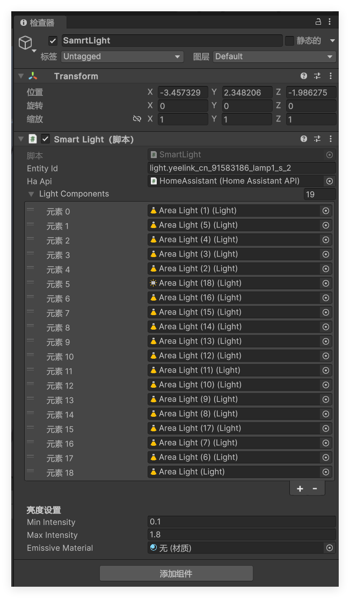

# Unity3D与HomeAssistant通信

**测试平台**：Unity3D 2023.1.12f1c1
## 1. 项目结构概述

项目在`/Scrips`文件夹内，主要包含以下几个关键脚本：

- `HomeAssistantAPI.cs`: 处理与HomeAssistant的HTTP API通信
- `HomeAssistantWebSocket.cs`: 处理与HomeAssistant的WebSocket连接
- `SmartLight.cs`: 控制Unity场景中的灯光对象
- `HomeManager.cs`: 管理智能家居设备的状态

## 2. 设置步骤

### 步骤1: 安装需要的Unity包

#### 1. 安装 Newtonsoft.Json

在Unity中，通过Package Manager安装Newtonsoft.Json：

1. 打开 Unity 窗口
2. 点击菜单 窗口 > 包管理器
3. 点击右上角的搜索框
4. 输入以下名称：
   ```
   Newtonsoft
   ```
5. 点击安装

#### 2. 安装 NativeWebSocket

NativeWebSocket 不是官方包，需要通过 Git URL 安装：

1. 打开 Unity
2. 点击菜单 窗口 > 包管理器
3. 点击左上角的 "+" 按钮
4. 选择 "安装来自git URL 的包..."
5. 输入以下URL：
   ```html
   https://github.com/endel/NativeWebSocket.git
   ```
6. 点击 "安装" 按钮

### 3. 重新编译项目

安装完这两个包后，尝试重新编译项目

<br/>

### 步骤2: 创建HomeAssistant对象

1. 在Unity场景中创建一个空游戏对象，命名为"HomeAssistant"
2. 将`HomeAssistantAPI.cs`、`HomeAssistantWebSocket.cs`、`HomeManager.cs`三个脚本添加到该对象上
3. 在Inspector面板中设置以下参数：
   - `Ha Server Url`: 您的HomeAssistant服务器URL (如: `http://192.168.xx.xx:8123`)
   - `Long Lived Token`: HomeAssistant长期访问令牌。在HA面板 左下角用户名-安全-长期访问令牌 可以创建
   - `HomeManager.cs`脚本内的两个“无”，点击右边的圆圈并选中对应的脚本


### 步骤3: 设置智能灯光对象

1. 在场景中创建空对象，随意命名即可
2. 将`SmartLight.cs`脚本添加到该对象上
3. 在Inspector面板中设置以下参数：
   - `Entity Id`: HomeAssistant中对应灯光的实体ID (例如: `light.yeelink_cn_91583186_lamp1_s_2`)
   - `Ha Api`: 点击右边的圆圈并选中对应的对象
   - `Light Components`: 如果灯光组件不在当前对象上，可以手动指定灯光组件，将需要控制的光源拖入即可，多个光源可点击下面的＋号
   - 设置亮度范围: `Min Intensity`和`Max Intensity`
   - 如果需要发光材质效果，设置`Emissive Material`



## 3. 使用示例

### 控制灯光

点击上方的开始，观察控制台内的消息。此时在HA内对你输入的Entity Id的设备进行开关灯，游戏内的灯光应当会迅速反应

若出现问题，请观察控制台内的消息。可以让AI阅读代码和报错，来帮助解决问题

## 4. 注意事项

1. 确保Unity项目能够访问到HomeAssistant服务器（网络连接正常，ip正确）
2. 长期访问令牌需要从HomeAssistant中生成，并且具有适当的权限
3. 实体ID必须与HomeAssistant中的实体ID完全匹配（进入HA面板，设置>设备与服务>实体>实体标识符）
4. 确保开头提到的Unity包已安装启用

## 5. 故障排除

- 如果无法连接到HomeAssistant，检查网络连接和服务器URL
- 如果控制命令无效，检查长期访问令牌是否有效，以及实体ID是否正确
- 查看Unity控制台中的错误消息，它们通常会提供有用的调试信息

## 6. 已知BUG

第一次使用或一段时间内没有使用，偶尔会响应不及时，暂时没搞懂原因

## 7. 后续计划-可能拓展的功能
对于一些电器的开关示意，目前的想法是通过改变模型的颜色来表示开或关。`HomeAssistantWebSocket.cs`的内容已经包含基础的对`switch.`电器实体的处理。
